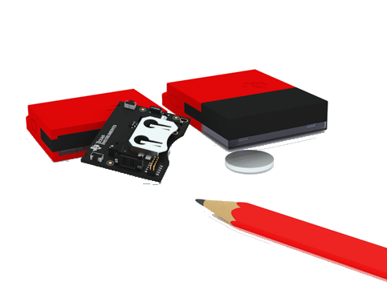
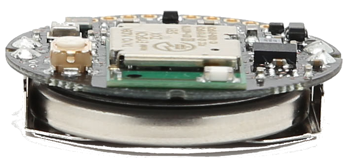
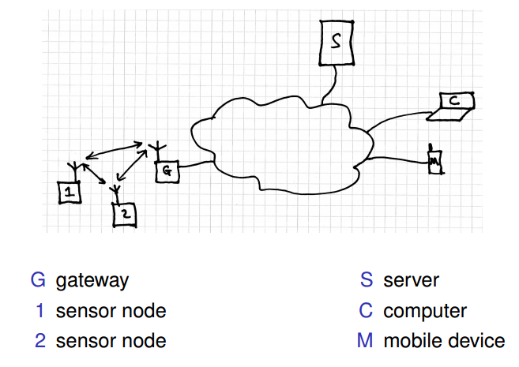
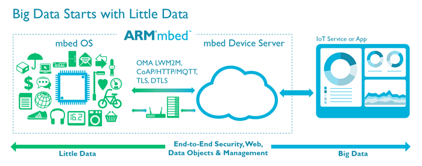

# Introduction
I'm interested in software development in the areas of Internet of Things, embedded systems, computer networking,
privacy and 'big data'. I'm also interested in mathematical modelling and analysis of systems. If you want me to 
supervise your project, ideally some of your interests should be at least loosely related to some of mine.

The next section gives a list of particular topics that I have in mind
for this year. Any one of them could form the basis of an interesting
project. If one or more of these topics grabs your interest, do some
preliminary reading to get a rough idea of what might be involved and then
speak to me to develop your ideas further. If you don't like any of these ideas
but you think you'd like to do something in a related area, speak to me about
it. If you want to have a chat about doing a project with me, just drop me an
email to arrange an appointment: [ david.kendall@northumbria.ac.uk ](
mailto:david.kendall@northumbria.ac.uk ).

# Project ideas 2016-17

## Internet of Things
This is a really exciting area at the moment and offers a wide range of interesting
projects. The <a href="http://mbed.org/cookbook/IOT">Internet of Things</a>
refers to a world where a large number of physical objects are addressable
via the Internet. The reference earlier will give you some idea of what
can be done but by no means tells the whole story.

The figure above gives a simplified, but reasonably complete, view of an IoT system. There are
some sensor nodes, connected via a gateway to the Internet (the cloud in the
picture). A server gathers the data collected by the sensor nodes and can be
accessed in real-time by computers or mobile devices, which can be used to
monitor and control the environment of the sensor nodes. Big data analysis can
be used to mine information from the data stored on the server. 

This can be the starting point for any number of projects, e.g.

  * **Wireless protocols** Look at the wireless protocols used by the sensor
    nodes to communicate with each other and with the gateway. [Bluetooth Low
    Energy](https://www.bluetooth.com/what-is-bluetooth-technology/bluetooth-technology-basics/low-energy),
    [802.15.4](http://www.ieee802.org/15/pub/TG4.html),
    [WiFi](http://www.wi-fi.org/discover-wi-fi) and
    [LoraWAN](https://www.lora-alliance.org/What-Is-LoRa/Technology) are all
    candidates for the low-level protocol, while
    [Zigbee](http://www.zigbee.org/what-is-zigbee/), and
    [6LoWPAN](https://docs.mbed.com/docs/arm-ipv66lowpan-stack/en/latest/quick_start_intro/index.html)
    offer higher-level mesh networking capabilities. You could set up some
    experiments to investigate aspects of the behaviour and performance of one
    or more of these protocols.

  * **Operating systems for IoT devices** Look at the operating systems and
    methods of programming the sensor nodes, e.g.  [ARM mbed
    OS](https://www.mbed.com/en/platform/mbed-os/),
    [Contiki](http://www.contiki-os.org/), [RiotOS](https://www.riot-os.org/),
    [uC/OS-II](https://www.micrium.com/rtos/). The first three in this list
    have been developed specifically for IoT devices, while the fourth is a
    general purpose RTOS. You could develop some simple experiments to compare
    any two of these approaches, or alternatively, you could develop a larger
    application using one approach, and comment on your experience.

  * **Message protocols** Look at the protocols for communicating with the server: [MQTT](http://mqtt.org/) and
    [CoAP](http://coap.technology/) are likely candidates here. There are good
    server-side
    ([Mosquitto](http://projects.eclipse.org/projects/technology.mosquitto))
    and client-side ([Paho](http://www.eclipse.org/paho/)) implementations of
    MQTT. Alternatively, you could develop an application-specific protocol
    using HTML5 websockets, (e.g. see the [Autobahn
    project](http://autobahn.ws/)). Again, you could develop some simple
    experiments to compare these approaches, or if you prefer, you could
    develop a larger application using one approach, and comment on your
    experience.

  * **IoT servers** Look at the implementation of the server. The server can be implemented from scratch.
    There is a variety of approaches: asynchronous or multi-threaded, SQL or NoSQL database, Java
    or Python or Javascript or … and so on. Alternatively, you can use one of
    the many available cloud services, e.g. [ARM cloud
    services](https://www.mbed.com/en/platform/cloud/), [IBM
    Watson](http://www.ibm.com/internet-of-things/),
    [Xively](https://www.xively.com/) etc. It would be worth considering the
    advantages and disadvantages of one or more of these approaches, based on
    experiment or application development experience.

  * **Building the client interface** Look at design and implementation of the
    web user interface. The user interface can be developed with varying levels
    of support, from very little, e.g. raw HTML, CSS and Javascript, to a great
    deal, e.g. by using a complete 3rd-party system such as [Freeboard]
    (https://freeboard.io/)([An easy interface for the Internet of
    Things](https://www.technologyreview.com/s/526006/an-easy-interface-for-the-internet-of-things/)).
    If your main interest is mobile apps, you could consider [Apache
    Cordova](https://cordova.apache.org/).
    A project in this area could explore the requirements for IoT applications
    and compare and contrast two or more approaches.

  * **Security** Look at IoT security. Putting your devices online makes them vulnerable,
    e.g. see [this blog
    post](https://www.troyhunt.com/controlling-vehicle-features-of-nissan/)
    about recent security issues with the Nissan Leaf. There are protocols that
    you can use to make your devices less vulnerable, e.g. TLS and DTLS. How do
    these fit with resource-constrained IoT devices? Are there other protocols
    that should be considered?

  * **Big data** Look at the data analysis tools available for extracting useful information from
    the large amount of data that can be generated by IoT systems. I've supervised projects involving
    [Hadoop](http://hadoop.apache.org/) and [Spark](http://spark.apache.org/).
    You might want to look at even more up to date tools such as
    [Apex](https://apex.apache.org/).

The diagram below shows a view from ARM of how all this might fit together.

Of course you might just want to develop some nice application that draws on several of these areas for its challenge, academic
content and scope for literature review. That's fine. Some application-based projects that I've supervised recently include:

  * autonomous Scalextric car
  * wheeled robot for SLAM (simultaneous localisation and mapping)
  * iOS-based fitness tracking and mapping app

These projects could be modified or extended, or might just inspire your own idea. Send me an email to arrange to talk to me.

## Quantum Leaps: event-driven programming for embedded systems
The <a href="http://www.state-machine.com/">Quantum Leaps</a> software provides a family of lightweight, RTOS-like frameworks for event-driven programming of embedded systems. A project in this area would involve deploying QP on the [LPC4088 Quickstart Board](https://developer.mbed.org/users/embeddedartists/notebook/lpc4088-quickstart-board/), implementing a small control system using two different approaches, one using QP and another using a more traditional OS such as uC/OS-II, and comparing the approaches, considering performance of the code, ease of development, maintainability etc. 

## Online privacy and anonymity

Online privacy and anonymity are currently hot topics following <a
href="http://www.theguardian.com/world/the-nsa-files">Edward Snowden's
revelations</a> about the extent of government surveillance of
electronic communications. [Ross Anderson](http://www.cl.cam.ac.uk/~rja14/#Lib)
has discussed the flaws in the UK government's Investigatory Powers bill.
The <a href="http://prism-break.org/">PRISM /
BREAK</a> organisation is already giving advice about what steps users can take
to enhance their online privacy.  You could use your project as an opportunity
to find out more about some of the technical issues involved. For example, you
could

  * develop a prototype P2P anonymity network using <a
    href="http://python.org/">Python</a> and its network event engine <a
    href="http://twistedmatrix.com/trac/wiki">Twisted</a>, or 

  * design and run some experiments using the <a
    href="http://shadow.github.io/">Shadow simulator</a> to investigate aspects
    of the <a href="https://www.torproject.org/">Tor</a> anonymity network, or

  * investigate the use of a probabilistic model-checker for the analysis of
    anonymity protocols, e.g. see work by <a
    href="http://www.cs.utexas.edu/users/shmat/shmat_crowds.pdf">Shmatikov</a>.

## Software-defined networking
Software-defined networking is a new approach to networking in which
the control and data planes are clearly separated. This enables a more
modular approach to the provision of network services than has been
possible so far.  Scott Shenker gave a <a
href="http://www.youtube.com/watch?v=YHeyuD89n1Y">nice
presentation</a> on the main ideas and advantages a couple of years
ago. A project in this area could use <a href="http://mininet.org/">Mininet</a> to

  * recreate networking experiments from the literature and compare your
    results, see, for example, <a
    href="http://reproducingnetworkresearch.wordpress.com/">REPRODUCING NETWORK
    RESEARCH</a>, or

  * build your own network controller to implement a new security policy, for
    example.

<!--<section>-->
<!--<title>Older project ideas</title>-->
<!--
-->
<!--Many of the suggestions below could still form the basis of a good project. Get-->
<!--in touch if you're interested in any of them.-->
<!--
-->
<!--<ul>-->
<!--<li> Deploy and compare FreeRTOS and uC/OS-III on ARM platform</li>-->

<!--<li> Add support for FAT filesystem to embedded OS. Analyse performance</li>-->

<!--<li> Interface a communications module (e.g. Bluetooth, Zigbee, GSM,-->
<!--GPS, ...) to embedded system development board. Design and implement-->
<!--drivers and API. Test and analyse performance.</li>-->

<!--<li> Develop Controller Area Network (CAN) driver and high-level API</li> -->

<!--<li> Investigate a real-time communications protocol, e.g. Flexray, TTA, TT-Ethernet, MILCAN</li>-->

<!--<li> Design, implement and test 802.15.4 to CAN gateway</li>-->

<!--<li> Implement and analyse performance of 6LoWPAN</li>-->

<!--<li> Develop application and analyse performance of accelerometer module</li>-->

<!--<li> Investigate tightness of bounds of WCET analyser</li>-->

<!--<li> Apply model checking to analysis of security properties of a communciation protocol</li>-->

<!--<li> Develop a tool to generate automatically correct ACLs from a-->
<!--specification of required security properties</li>-->

<!--<li> Investigate automatic code generation for CAN-based,-->
<!--time-triggered embedded systems with multiple tick rates derived from-->
<!--a shared clock.</li>-->

# Writing your dissertation

## Content and Presentation
Some of your content will be based on your literature review. This
will involve reading some literature. Unless you have a plan, your
reading will be inefficient. <a href="http://cgweb1.northumbria.ac.uk/SubjectAreaResources/cgdk2/how_to_read_a_research_paper.pdf">How to read a research
paper</a> is an excellent guide to forming a plan for reading a
paper. Follow its advice.

<a href="http://www.amazon.co.uk/Writing-Computer-Science-effective-Communication/dp/1852338024/ref=sr_1_1?ie=UTF8&amp;qid=1330186621&amp;sr=8-1">Writing
for Computer Science</a> is a good general text book about effective
communication in Computer Science.

If you don't want to splash out on a text book, there are several
sites with links to a variety of advice about how to write
clearly. Not all of the advice is directly relevant to writing a
B.Sc. or M.Sc. dissertation in Computing or Engineering. The advice
may not even be consistent. However, it is well worth reading, as you
begin to form your own ideas about how to write a good
dissertation. The sites that I find most useful are:

  * <a href="http://www.computersciencestudent.com/">William Stallings How-To</a>
  * <a href="http://www.cs.cmu.edu/afs/cs.cmu.edu/user/mleone/web/how-to.html">Carnegie Mellon: Advice on Research and Writing</a>
  * <a href="http://www.cs.columbia.edu/~hgs/etc/writing-style.html">Writing technical articles</a>

However, before rushing to devour all of the hints and tips available
from these pages, you should remember that the most valuable document
for you is the <strong>project handbook</strong> for the module that
you are studying. You should pay particular attention to the marking
guidelines and ensure that, for each part of your dissertation, you
have addressed <strong>all</strong> of the requirements of the marking
scheme. And when the project handbook requires an approach that
differs from that suggested by some other document, it is the project
handbook that you should follow. All of the general writing guidelines
in the world are of little benefit if you do not adhere strictly to
the specific requirements of the organization to which you intend to
submit your document.

Once you're clear about the advice in your project handbook, you may
find the following helpful for parts of your dissertation. Remember
that much of the advice below is written for academics intending to
submit a journal or conference paper. You'll need to interpret it
carefully to make it fit the requirements of a dissertation.

<em>Abstract</em>

  * <a href="http://www.ece.cmu.edu/~koopman/essays/abstract.html">How
to write an abstract</a>: excellent advice from Philip Koopman.

  * <a
    href="http://www.sigplan.org/Resources/Advice/VanLeunen-Lipton/">How
    to have your abstract rejected</a>: may not be directly relevant but it's
    quite funny.
    

<em>Main report body</em>

  * <a href="http://www.sce.carleton.ca/faculty/chinneck/thesis.html">How to
    organize your thesis</a>: intended mainly for Ph.D. dissertations - but if
    you disregard the references to the need to demonstrate an original
    contribution to knowledge, this works for M.Sc. and B.Sc. dissertations
    too.

  * <a
    href="https://www.microsoft.com/en-us/research/academic-program/write-great-research-paper/">How
    to write a great research paper</a>: you can guess this is advice about
    writing a paper, not a dissertation - but if you ignore the advice about
    length of each section, almost everything else applies to writing a
    dissertation as well.

<em>Bibliography, references, citations</em>

  * <a href="http://elp.northumbria.ac.uk/bbcswebdav/library/Library%20Content/Cite_them_right_secure.pdf">Cite them right</a>: essential reading.
  * Manage your bibliography with BibTeX. 
      * See <a href="http://www.tug.org/pracjourn/2006-4/fenn/">Managing
        Citations and Your Bibliography with BibTeX</a>
        and <a href="http://en.wikibooks.org/wiki/LaTeX/Bibliography_Management">LaTeX/Bibliography
        Management</a> to get started.
      * Keep an archive of the papers that you read for your own use. Use <a href="http://www.lri.fr/~filliatr/bibtex2html/">bibtex2html</a>
        to produce html versions of your bibligraphy. Provide links to
        full text versions whenever possible.</li>

<em>Style</em>

  * <a href="http://www.guardian.co.uk/styleguide">Guardian style guide</a>: I
    like the Guardian's style. It's a good guide to modern British English.

  * <a href="http://www.cs.columbia.edu/~hgs/etc/writing-bugs.html">Henning
    Schulzrine</a> and <a
    href="http://www.ece.ucdavis.edu/~jowens/commonerrors.html">John Owens</a>
    have more specific advice about technical writing style.

  * <a href="http://www.cl.cam.ac.uk/~mgk25/publ-tips/">Markus Kuhn</a> offers
    good advice about preparing and preserving your publications.

<strong>Tools</strong>

<em>Writing</em> 

It's hard to imagine why anyone would write a Computing or Engineering
project dissertation using anything other
than <a href="http://www.latex-project.org/">LaTeX</a>. Its key
benefit is that it allows you to concentrate on
the <strong>content</strong> of your writing rather than
its <strong>layout</strong>. Also, it handles automatically the
production of lists of contents, tables and figures, and, using
BibTeX, it makes it easy to produce a bibliography and to manage
citations. It also enables you to construct
more <a href="http://nitens.org/taraborelli/latex">beautiful</a>
documents.

I've made available
some <a href="assets/ra/latex_resources.tgz">
resources </a> that show you how to use this tool to produce a
dissertation. The <a href="http://www.ctan.org/tex-archive/info/lshort/english/lshort.pdf">Not
so short introduction to LaTeX</a> should be used to answer your
general LaTeX queries. There's also a
useful <a href="http://en.wikibooks.org/wiki/LaTeX/">LaTeX
Wikibook</a> that is worth a look.

 
<strong>Download LaTeX resources, including a sample dissertation.</strong>
   

<em>Version control</em>  

Writing a dissertation takes quite a long time. During this time you will
produce many versions of your dissertation. Occasionally, you will be
disappointed to discover that the latest version of your dissertation is not
entirely your best. You will be even more disappointed if you cannot recover
those parts from an earlier version that you now realise were better than your
latest version. You can avoid this disappointment by using a version control
system to maintain all of your dissertation sources. There are several good,
modern version control systems that are freely available. [Git]
(http://git-scm.com/) is now the most widely used. You should use it too.

